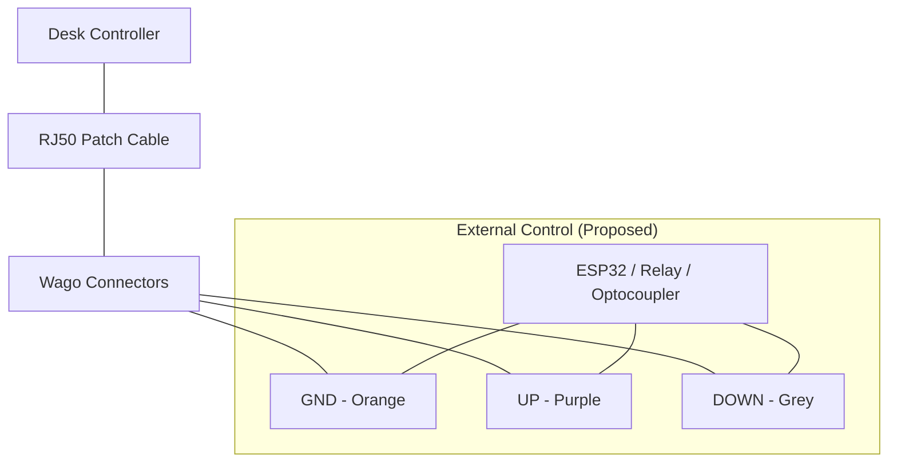

# Desktronic HomeOne Desk Hardware Hack

Documenting the technical journey of reverse engineering the Desktronic HomeOne standing desk controller to enable external control (e.g., via ESP32) without proprietary Bluetooth or WiFi.

## Disclaimer & Safety Warning

> [!CAUTION]
> This project involves working with open electronics and modifying factory cabling.
> - **Warranty**: Performing these modifications will almost certainly void your warranty.
> - **Hardware Damage**: Shorting the wrong pins or applying incorrect voltage can permanently damage your motor controller or handset.
> - **Proceed at your own risk.**

---

## Documentation Index

- **[Step-by-Step Tutorial](file:///Users/peter2/src/desktronic-desk/tutorial.md)**: A beginner-friendly guide to recreating this hack from scratch.
- **[Hardware Specifications](file:///Users/peter2/src/desktronic-desk/hardware.md)**: Detailed pinout tables and voltage measurements.

---

## Hardware Overview

- **Desk Model**: Desktronic HomeOne
- **Connector**: RJ50 (10P10C)
- **Method**: Serial Intercept using an RJ50 extension/patch cable and Wago connectors.

---

## The Journey: Reverse Engineering

### 1. Intercepting the Signal
Instead of cutting the original desk cable, an **extra RJ50 cable** was connected between the controller and the desk motor. This acted as a "breakout box," allowing us to strip individual wires and probe them safely while the system remained functional.

### 2. Finding Ground (GND)
Finding a reliable reference point is critical. On the low-voltage PCB (the side where the RJ50 connects), two small metal via circles were found that beeped when tested for continuity against the RJ50 wires.

- **Discovery**: The **Orange** wire in the RJ50 bundle was confirmed as **GND** via continuity testing to the PCB vias.

### 3. Mapping the Signals
With a solid GND reference (Orange), each wire was measured using a multimeter in DC Voltage mode (20V range) under three conditions: Idle, UP pressed, and DOWN pressed.

#### Signal Table (Referenced to Orange GND)

| Wire Color | Idle | UP Pressed | DOWN Pressed | Role |
| :--- | :--- | :--- | :--- | :--- |
| **Purple** | 5V | **0V** | 5V | **UP Signal** (Active Low) |
| **Grey** | 5V | 5V | **0V** | **DOWN Signal** (Active Low) |
| **Orange** | 0V | 0V | 0V | **Ground (GND)** |
| Yellow | 5V | 5V | 5V | VCC / Logic Power |
| Blue | 5V | 5V | 5V | VCC / Logic Power |
| Green | 5V | 5V | 5V | VCC / Logic Power |
| Black | 1V | 1V | 1V | Unknown / Data |
| Red | 5V | 5V | 5V | VCC / Logic Power |
| Brown | 5V | 5V | 5V | VCC / Logic Power |
| White | 0V | 0V | 0V | Likely GND / Shield |

### 4. Verification by "Shorting"
The logic was confirmed by momentarily connecting the identified signal wires to GND (Orange):
- **Orange + Purple** = Desk moves UP
- **Orange + Grey** = Desk moves DOWN

---

## Next Steps: ESP32 Integration

To automate the desk, an ESP32 or similar microcontroller can be tapped into these lines:
- Connect **ESP32 GND** to **Orange**.
- Use **Optocouplers** or **Transistors** to pull the **Purple (UP)** or **Grey (DOWN)** lines to GND logic-wise.
- **Note**: Since the lines sit at 5V, a direct connection to ESP32 GPIO (3.3V) is **not recommended** without level shifting or opto-isolation to protect the microcontroller.

---

## Wiring Diagram

